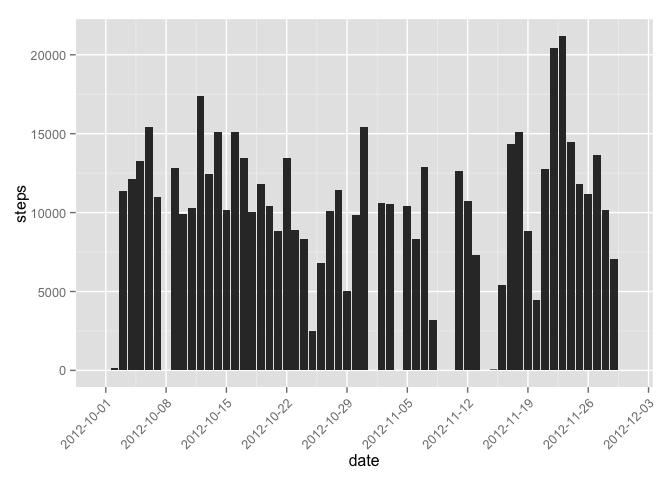
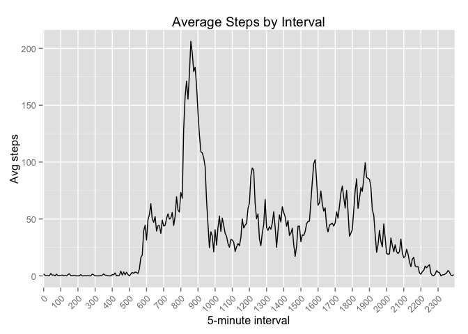
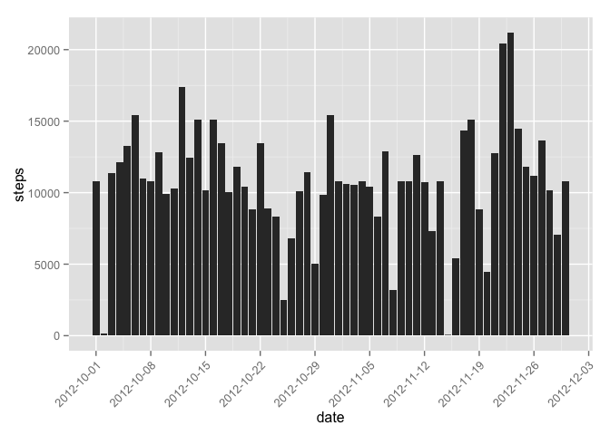
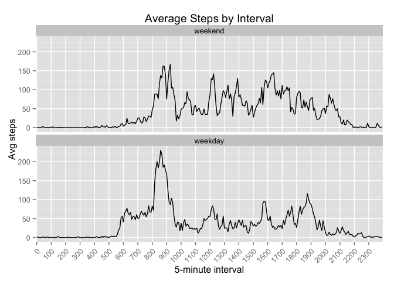

# Reproducible Research: Peer Assessment 1
Rubén Masó  
8 de octubre de 2015  


[Enlace](https://github.com/earino/RepData_PeerAssessment1/blob/master/PA1_template.Rmd)


## Loading and preprocessing the data
This data set is downloaded originally from [here](https://github.com/rmaso/RepData_PeerAssessment1/blob/master/activity.zip) and unziped

```r
filename <- 'activity.csv'
if (!file.exists(filename)) { 
  zipfile <- 'activity.zip'
  if (!file.exists(zipfile)){
    fileURL <- "https://github.com/rmaso/RepData_PeerAssessment1/blob/master/activity.zip"
    download.file(fileURL, zipfile) #method curl for OSX, remove to Windows OS
  }  
  unzip(zipfile) 
}
```

This script works under the assumptions:  
  * the working directory is set to the directory containing this script  
  * the directory contains a file called activity.csv  
  * the R installation has the ggplot2 library  

  Load the data

```r
activity <- read.csv(filename, stringsAsFactors=FALSE)
```

Transform the data into a format suitable for your analysis  
  * date: to Date format  
  * interval: as a Factor  

```r
activity$date <- as.Date(activity$date)
activity$interval <- as.factor(activity$interval)
```


## What is mean total number of steps taken per day?
First we load the required libraries for this analysis

```r
library(dplyr)
```

```
## 
## Attaching package: 'dplyr'
## 
## The following objects are masked from 'package:stats':
## 
##     filter, lag
## 
## The following objects are masked from 'package:base':
## 
##     intersect, setdiff, setequal, union
```

```r
library(ggplot2)
library(scales)
```

Let's aggregate by date the total number of steps taken and show a histogram.

```r
steps_by_date <- activity %>% 
                    group_by(date) %>%
                    summarise(steps = sum(steps, na.rm=TRUE))

ggplot(data = steps_by_date, aes(date, steps)) +
    stat_summary(fun.y = sum, geom = "bar") + # adds up all observations for the month
    scale_x_date(
        labels = date_format("%Y-%m-%d"),
        breaks = "1 week") + # custom x-axis labels
    theme(axis.text.x = element_text(angle = 45, hjust = 1))
```

 
  
Calculate and report the mean and median total number of steps taken per day

```r
summary_steps_by_date <- steps_by_date %>%
    summarise(mean=mean(steps),
              median=median(steps))
summary_steps_by_date
```

```
## Source: local data frame [1 x 2]
## 
##    mean median
##   (dbl)  (int)
## 1  9354  10395
```
For this data set, the mean number of steps taken per day is 9354.23 and the median is 10395.

## What is the average daily activity pattern?
The next exploratory step is to analyze the signal data (the steps) across the time domain. Let's do a time series plot of the 5-minute interval (x-axis) and the average number of steps taken, averaged across all days (y-axis)

```r
steps_by_interval <- activity %>% 
                        group_by(interval) %>%
                        summarise(steps = mean(steps, na.rm=TRUE))

ggplot(steps_by_interval, aes(x=interval, y=steps, group=1)) +
    geom_line() + 
    xlab("5-minute interval") + 
    ylab("Avg steps") + 
    ggtitle("Average Steps by Interval") +
    scale_x_discrete(breaks = 100*0:24) +
    theme(axis.text.x = element_text(angle = 45, hjust = 1))  
```

 

Which 5-minute interval, on average across all the days in the dataset, contains the maximum number of steps?

```r
max_interval <- steps_by_interval[steps_by_interval$steps == max(steps_by_interval$steps),]
```
The interval throughout the day which has the maximum number of steps is interval number 835.

## Imputing missing values
Calculate and report the total number of missing values in the dataset (i.e. the total number of rows with NAs)

```r
completed <- complete.cases(activity)
missing_record_count <-sum(!completed)
missing_record_count
```

```
## [1] 2304
```
There are 2304 records with an NA. This is 13.11% of the data set.  Let's take a simple approach to impute the missing data. We will store this in a new data frame, activity.filled.  
  * Get the interval values for any non-complete cases  
  * Retrieve the mean values from our steps_by_interval data frame  
  * Replace the missing values from the retrieved data  

```r
activity.filled <- activity

interval_indices <- match(activity.filled[!completed, "interval"],steps_by_interval$interval)

activity.filled[!completed, "steps"] <- steps_by_interval[interval_indices, "steps"]
```


Make a histogram of the total number of steps taken each day and Calculate and report the mean and median total number of steps taken per day. 

```r
steps_by_date.filled <- activity.filled %>% 
                    group_by(date) %>%
                    summarise(steps = sum(steps, na.rm=TRUE))

ggplot(data = steps_by_date.filled, aes(date, steps)) +
    stat_summary(fun.y = sum, geom = "bar") + # adds up all observations for the month
    scale_x_date(
        labels = date_format("%Y-%m-%d"),
        breaks = "1 week") + # custom x-axis labels
    theme(axis.text.x = element_text(angle = 45, hjust = 1))
```

 
There is nothing immediately alarming about this histogram, the imputation seems to have been reasonable. Overall the data looks sane and definitely more full.

Let's calculate a few descriptive statistics on this imputed data set:

```r
summary_steps_by_date.filled <- steps_by_date.filled %>%
    summarise(mean=mean(steps),
              median=median(steps))
summary_steps_by_date.filled
```

```
## Source: local data frame [1 x 2]
## 
##    mean median
##   (dbl)  (dbl)
## 1 10766  10766
```
For this data set, the mean number of steps taken per day is 10766.19 and the median is 10766.19.

## Are there differences in activity patterns between weekdays and weekends?

Create a new factor variable in the dataset with two levels -- "weekday" and "weekend" indicating whether a given date is a weekday or weekend day.


```r
is_weekend <- as.POSIXlt(activity.filled$date)$wday %in%c(0,6)
activity.filled$day_type <- factor(ifelse(is_weekend, "weekend", "weekday"))
```


Make a panel plot containing a time series plot of the 5-minute interval (x-axis) and the average number of steps taken, averaged across all weekday days or weekend days (y-axis).


```r
#Compute mean for weed days
steps_by_interval_weekday <- activity.filled %>% 
                                filter(day_type == "weekday") %>%
                                group_by(interval) %>%
                                summarise(steps = mean(steps, na.rm=TRUE))

#Compute mean for weed days
steps_by_interval_weekend <- activity.filled %>% 
                                filter(day_type == "weekend") %>%
                                group_by(interval) %>%
                                summarise(steps = mean(steps, na.rm=TRUE))

#set appropriate factor for each data
steps_by_interval_weekday$day_type <- "weekday"
steps_by_interval_weekend$day_type <- "weekend"

#combine weekends and weekdays into a single data frame
steps_by_interval_combined <- rbind(steps_by_interval_weekday, 
                                    steps_by_interval_weekend)

#convert character to a factor, setting explicit order so the ggplot command
#will set weekends above weekdays as per diagram in assingment description
steps_by_interval_combined$day_type <- factor(steps_by_interval_combined$day_type,
                                              levels=c("weekend", "weekday"))

ggplot(steps_by_interval_combined, aes(x=interval, y=steps, group=1)) + geom_line() + 
  xlab("5-minute interval") + 
  ylab("Avg steps") + 
  ggtitle("Average Steps by Interval") + facet_wrap(~ day_type, ncol=1) +
  scale_x_discrete(breaks = 100*0:24) +
  theme(axis.text.x = element_text(angle = 45, hjust = 1))
```

 


